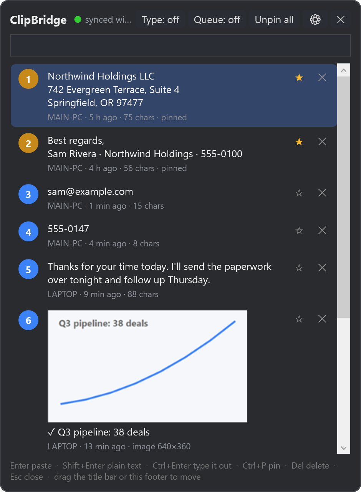
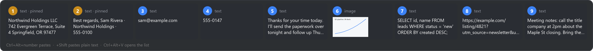

# ClipBridge

A clipboard manager for Windows 10/11 that pastes any recent item with one hotkey, pins up to
five items to fixed slots, and keeps the same clipboard history on two PCs (for example a main
machine and a VM) over an encrypted LAN connection.



## Features

- **Paste by number.** Ctrl+Alt+1 … Ctrl+Alt+9 paste slot 1–9 straight into the app you are in. No list to open.
- **Pins.** Up to five pinned items always sit in slots 1–5, so a pinned item keeps its number. Pasting never reorders the list; only copying something new does.
- **HUD.** Hold Ctrl+Alt for half a second to see a strip showing what the nine slots currently hold.

  

- **Text, rich text, images, and files.** Images are stored as PNG. Text inside images is read with the OCR built into Windows, so screenshots become searchable.
- **Two-machine sync.** Both PCs run ClipBridge and share a key. Items, pins, deletions, images, and files (under a size cap) are mirrored in both directions. Machines find each other automatically on the LAN.
- **Plain-text paste.** Add Shift to any slot hotkey to paste without formatting.
- **Type-it-out mode.** Ctrl+Alt+T makes the slot hotkeys type the text as keystrokes instead of pasting, for remote desktops and apps that block paste.
- **Paste queue.** Ctrl+Alt+Q starts a queue; everything you copy joins it. Ctrl+Alt+P pastes the next item, in order.
- **Transforms.** Right-click an item to paste it UPPERCASE, lowercase, trimmed, or with tracking junk stripped from URLs.
- **Search, delete, save image as, unpin all.** The list window (Ctrl+Alt+V) can be dragged anywhere and reopens where you left it.

## Hotkeys

| Keys | Action |
| --- | --- |
| Ctrl+Alt+1 … 9 | Paste slot 1–9 |
| Ctrl+Alt+Shift+1 … 9 | Paste slot 1–9 as plain text |
| Ctrl+Alt+V | Open / close the list window |
| hold Ctrl+Alt (½ s) | Show the HUD strip |
| Ctrl+Alt+T | Type-it-out mode on / off |
| Ctrl+Alt+Q | Paste queue on / off |
| Ctrl+Alt+P | Paste the next queued item |

In the list window: Enter pastes, Shift+Enter pastes plain, Ctrl+Enter types it out, Ctrl+P pins or
unpins, Del deletes, Esc closes, and typing filters the list.

## Install

1. Download `ClipBridge-win-x64.zip` from the [Releases](../../releases) page and unzip it.
   (The `framework-dependent` zip is much smaller but needs the
   [.NET 8 Desktop Runtime](https://dotnet.microsoft.com/download/dotnet/8.0) installed first.)
2. Run `Install ClipBridge.cmd`. It copies the app to `%LocalAppData%\Programs\ClipBridge`, asks once for
   admin rights to add firewall rules for sync, creates a Start Menu shortcut, and starts the app. The app
   starts with Windows from then on.
3. On the second machine, run the same installer and enter the sync key shown by the first machine
   (tray icon → Settings, or the balloon on first start).

The exe is not code-signed, so Windows SmartScreen may show "Windows protected your PC" the first time.
Click **More info → Run anyway**, or build it yourself from source.

## Sync details

- Each machine listens on TCP 47821 and announces itself by UDP broadcast on 47820. Machines with the same
  key connect to each other; one encrypted link (AES-256-GCM, key derived from your passphrase) is kept.
- If discovery does not work on your network (VLANs, some Wi-Fi isolation), enter the other machine's IP
  under Settings → Peer address.
- Received files land in `%LocalAppData%\ClipBridge\Received` and paste as real files on the other machine.
- Limits (all changeable in Settings): 100 items, 10 MB per image, 50 MB per file transfer, 5 pins.

## Privacy

History is stored unencrypted in `%LocalAppData%\ClipBridge\clipbridge.db` on each machine, like most
clipboard managers. Anything you copy, including passwords, is kept until you delete it or it ages out of
the 100-item history. Use "Pause capturing" in the tray menu when you do not want something recorded, and
"Clear unpinned history" to wipe. Nothing leaves your LAN; there is no cloud component.

## Build from source

Requires the .NET 8 SDK.

```
dotnet publish -c Release
```

Output: `bin\Release\net8.0-windows10.0.19041.0\win-x64\publish\ClipBridge.exe`.

Handy switches: `ClipBridge.exe --data <folder>` runs a separate instance with its own data folder
(for testing two instances on one PC), and `ClipBridge.exe --dump` writes the current slot list to
`dump.txt` in the data folder.

## License

MIT. See [LICENSE](LICENSE).
